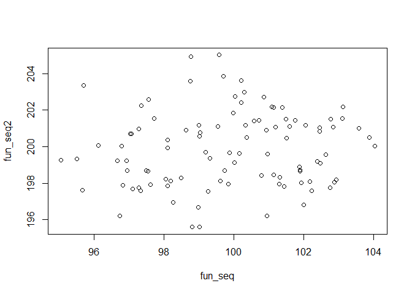

# Class04 R Markdown
# This is my new R Markdown file

## This is a my new text file.

  * It's so much fun
  * Is it really though?
  * fact the first: ctrl+alt+i = insert code chunk
  * fact the second: can change the figure height/width in the chunk header section


```r
fun_seq <- rnorm(100,100,2)
fun_seq2 <- rnorm(100,200,2)
plot(fun_seq, fun_seq2)
```

<!-- -->


```r
summary (fun_seq)
```

```
##    Min. 1st Qu.  Median    Mean 3rd Qu.    Max. 
##   95.13   99.01  100.37  100.43  101.71  107.24
```

```r
summary (fun_seq2)
```

```
##    Min. 1st Qu.  Median    Mean 3rd Qu.    Max. 
##   195.8   198.5   199.9   199.8   201.3   203.9
```


